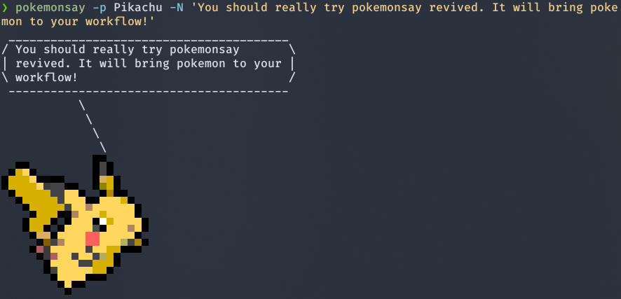

pokemonsay : New Generations
==========



`pokemonsay` is like [`cowsay`][cowsay] but for pokémon only. Internally, `pokemonsay` still uses `cowsay`, so you need it installed too. This repo is a revamp of the original [`pokemonsay`][original_pokemonsay], which looks abandoned now, I'm a big fan of pokemon, so I took the mantle to update it. This version includes all pokemon sprites found in the [bulbapedia][bulbapedia] national dex, including alternate forms (like Alolan and Galarian).

## Dependencies

If you simply want to use `pokemonsay`, the only thing you need installed is `cowsay`. But you are probably interested in `fortune` as well, to provide random sayings to your pokémon.

### Arch Linux

If you use Arch Linux, or other Arch-based distros like me, you can install the dependencies for `pokemonsay` as follows:

```bash
sudo pacman -S fortune-mod cowsay
```

### Ubuntu

 To install them in Ubuntu, simply run :

```bash
sudo apt-get install fortune cowsay
```

## Installation

Keep in mind that `pokemonsay` will only work if you have `cowsay` installed and available in your `$PATH`. To install `pokemonsay` run these commands in a terminal window:

```bash
git clone http://github.com/possatti/pokemonsay
cd pokemonsay
./install.sh
```

After the last command, you will have `pokemonsay` installed in you home folder in `~/.bin/pokemonsay/`. And an symbolic link will be created in `~/bin/pokemonsay`, so that you can have `pokemonsay` in your `$PATH` too.

### Arch Linux

Again, if you use Arch Linux or any other Arch-based distro, you can get pokemonsay from the AUR (using `yay` for example):

```bash
yay -S pokemonsay-newgenerations-git
```

## Usage

Now that you've installed `pokemonsay`, you can make it work like so:

```bash
pokemonsay Hello World
```

To have a random pokémon saying some random thing to you, use `fortune`:

```bash
fortune | pokemonsay
```

And if you really like it, you can add the command above to the end of your `~/.bashrc` file (or equivalent). So you will have a random pokémon speaking to you whenever you open a new terminal window! :D

You get a cowthink-like version too. Try it:

```bash
pokemonthink --pokemon Charmander "Should I wear some clothes?"
```

### Forms

Some pokemon have alternate forms, such as Alolan and Galarian, to use theses forms you can provide a `-FORM` after the pokemon name, where the form is one from the list bellow, keep in mind that only pokemon with alternate forms can be invoked like this.

```bash
pokemonthink --pokemon Raichu-A "I am in Alola !"
```

The available forms are:

- `-A` : For Alolan forms
- `-G` : For Galarian forms
- `-F` : For pokemon with female alternate sprites

And alternate forms for some pokemon:
- `Giratina-O` : Origin Form Giratina
- `Shaymin-S` : Sky FormS haymin
- `Basculin-B` : Blue Basculin
- `Burmy-G` : Sandy Cloak Burmy
- `Burmy-S` : Trash Cloak Burmy
- `Calyrex-I` : Ice Rider Calyrex
- `Calyrex-S` : Shadow Rider Calyrex
- `Castform-H` : Snowy Form Castform
- `Castform-R` : Rainy Form Castform
- `Castform-S` : Sunny Form Castform
- `Darmanitan-Z` : Zen Mode Darmanitan
- `Darmanitan-GZ` : Galarian Zen Mode Darmanitan
- `Deoxys-A` : Attack Form Deoxys
- `Deoxys-D` : Defense Form Deoxys
- `Deoxys-S` : Speed Form Deoxys
- `Gastrodon-E` : East Sea Gastrodon
- `Hoopa-U` : Unbound Hoopa
- `Meloetta-P` : Pirouette Form Meloetta
- `Rotom-F` : Fan Rotom
- `Rotom-L` : Mow Rotom
- `Rotom-O` : Heat Rotom
- `Rotom-R` : Frost Rotom
- `Rotom-W` : Wash Rotom
- `Shellos-E` : East Sea Shellos
- `Wormadam-G` : Sandy Cloak Wormadam
- `Wormadam-S` : Trash Cloak Wormadam
- `Zacian-C` : Crowned Form Zacian
- `Zamazenta-C` : Crowned Form Zamazenta

(Yes, that's a lot of alternate forms)

## Uninstall

Just in case you hate Pokémon and you've installed `pokemonsay` "by mistake"... Humpf! You can uninstall it by running:

```bash
sh $HOME/.bin/pokemonsay/uninstall.sh
```

## Building the whole thing

If you want to rebuild everything in the repository,  To install it you will need to build from source. The instructions are provided on their repository. And if you know an easier way, please tell me!

In order to use `pokemonsay` you don't need to build anything because everything is built already within the repository. But if you want to download the whole images again or make some change in the process, you will also need [`img2xterm`][img2xterm] which is used to generate cowfiles from the pokémon images. Here is how it's done:

```bash
# Download pokémon images from Bulbapedia... Thanks bulbapedia!
sh ./tools/scrap_data.sh

# Manipulate the downloaded images, to make the pokémon look
# to the right, and trim the useless space around them.
sh ./tools/fix_images.sh

# Use 'img2xterm' to generate .cow files (for 'cowsay').
sh ./tools/make_cowfiles.sh
```

And there it is. Now install it with `install.sh` and you are done.

## NOTICE

Please notice I don't own Pokémon or anything related to it. Pokémon is property of [The Pokémon Company][the-pokemon-company].

[img2xterm]: https://github.com/rossy/img2xterm
[cowsay]: https://en.wikipedia.org/wiki/Cowsay
[original_pokemonsay]: https://github.com/possatti/pokemonsay
[the-pokemon-company]: https://en.wikipedia.org/wiki/The_Pok%C3%A9mon_Company
[bulbapedia]: https://bulbapedia.bulbagarden.net/wiki/List_of_Pok%C3%A9mon_by_National_Pok%C3%A9dex_number
